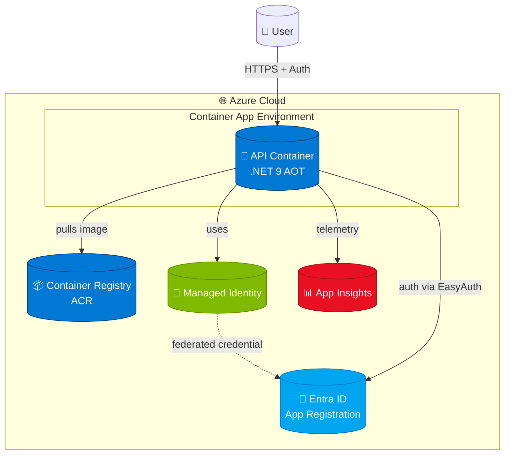
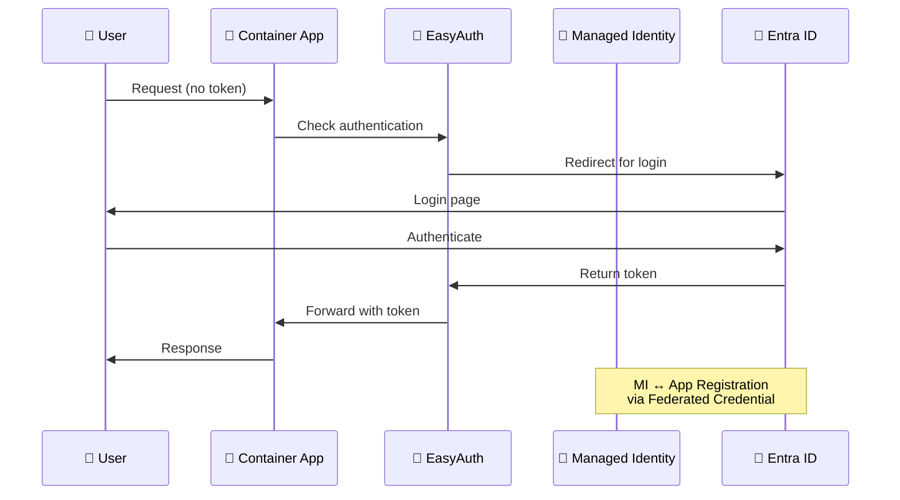

# 🚀 Azure Container Apps MCP Proxy with Federated Identity

> **Model Context Protocol (MCP) wrapper/proxy** deployed on Azure Container Apps with **zero-secrets** authentication using Entra ID federated credentials.

[](https://azure.microsoft.com/en-us/products/container-apps/)
[](https://www.terraform.io/)
[](https://dotnet.microsoft.com/)
[](https://learn.microsoft.com/en-us/dotnet/core/deploying/native-aot/)

## 🎯 What Does This Do?

This project demonstrates a **production-ready pattern** for deploying containerized APIs on Azure with enterprise-grade security:

- 🔐 **No secrets stored anywhere** - uses federated identity credentials
- 🎫 **Entra ID authentication** via EasyAuth on Container Apps
- 🏗️ **Infrastructure as Code** with Terraform and Azure Developer CLI
- ⚡ **Native AOT compilation** for fast startup and minimal memory
- 📊 **Built-in observability** with Application Insights

## 🏛️ Architecture



### 🔐 Zero-Secrets Authentication Flow



## 🚦 Quick Start

### Prerequisites

- ✅ Azure subscription
- ✅ [Azure Developer CLI](https://learn.microsoft.com/en-us/azure/developer/azure-developer-cli/install-azd)
- ✅ [.NET 9 SDK](https://dotnet.microsoft.com/download/dotnet/9.0)
- ✅ [Terraform](https://www.terraform.io/downloads)

### 🎬 Deploy Everything

```bash
# One command to rule them all
azd up
```

This will:
1. 📦 Build container image with AOT compilation
2. 🏗️ Provision Azure infrastructure (Container Apps, ACR, Entra ID app)
3. 🔐 Configure federated identity credentials
4. 🚀 Deploy the container
5. 🔗 Output the API endpoint URL

### 🧪 Local Development

```bash
cd src/MCPWrapper/MCPWrapper.Api
dotnet run
```

Access at `http://localhost:5000` (or check console output for port)

## 📁 Project Structure

```
📂 aca-mcp-proxy-obo-flow/
├── 📂 .github/
│   └── copilot-instructions.md    # 🤖 AI agent guidance
├── 📂 infra/                       # 🏗️ Terraform IaC
│   ├── identity.tf                 # 🔐 Managed Identity + Entra ID
│   ├── containerapps.tf            # 🔵 Container App + Auth config
│   ├── main.tf                     # 🏛️ Core resources (ACR, Log Analytics)
│   ├── rbac.tf                     # 👥 Role assignments
│   └── provider.tf                 # ⚙️ Provider configuration
├── 📂 src/MCPWrapper/
│   └── MCPWrapper.Api/             # 💻 .NET 9 API
│       ├── Program.cs              # 🎯 Minimal API with AOT
│       ├── Dockerfile              # 🐳 Multi-stage build
│       └── MCPWrapper.Api.csproj   # 📦 Project config
└── azure.yaml                      # 🎛️ Azure Developer CLI config
```

## 🔑 Key Features

### 🛡️ Security
- **Zero secrets** - federated identity credential pattern
- **EasyAuth** - authentication at platform level (no code changes needed)
- **Managed identities** - for ACR pull and future Azure service access
- **Entra ID integration** - enterprise identity provider

### ⚡ Performance
- **Native AOT compilation** - faster startup, lower memory
- **Slim builder** - minimal runtime footprint
- **Container-optimized** - efficient image layers

### 🔧 Developer Experience
- **Azure Developer CLI** - simplified deployment workflow
- **Infrastructure as Code** - reproducible environments
- **Application Insights** - built-in observability

## 🎯 Why AzAPI Provider?

The `azurerm` Terraform provider doesn't yet support Container Apps authentication blocks (tracked in [issue #22213](https://github.com/hashicorp/terraform-provider-azurerm/issues/22213)). We use the **AzAPI provider** to directly call the ARM API:

```hcl
resource "azapi_resource" "api_auth_config" {
  type = "Microsoft.App/containerApps/authConfigs@2023-05-01"
  # ... EasyAuth configuration
}
```

## 🔄 Common Tasks

### 📊 View Logs
```bash
azd monitor --overview
```

### 🔄 Redeploy Code
```bash
azd deploy
```

### 🗑️ Clean Up Resources
```bash
azd down
```

### 🧹 Local Terraform Operations
```bash
cd infra
terraform plan -var-file=main.tfvars.json
terraform apply -var-file=main.tfvars.json
```

## 🎨 Environment Variables

The container app automatically receives:

| Variable | Description | Source |
|----------|-------------|--------|
| `AZURE_TENANT_ID` | Entra ID tenant | Auto-injected |
| `AZURE_CLIENT_ID` | Managed identity client ID | Auto-injected |
| `APPLICATIONINSIGHTS_CONNECTION_STRING` | Telemetry endpoint | Terraform output |
| `API_ENDPOINT` | Container app URL | Computed |
| `ASPNETCORE_ENVIRONMENT` | Runtime environment | Configuration |

## 🤝 Contributing

See [`.github/copilot-instructions.md`](.github/copilot-instructions.md) for detailed architectural guidance and conventions.

## 📚 Learn More

- [Azure Container Apps Documentation](https://learn.microsoft.com/en-us/azure/container-apps/)
- [Entra ID Federated Credentials](https://learn.microsoft.com/en-us/entra/workload-id/workload-identity-federation)
- [.NET Native AOT](https://learn.microsoft.com/en-us/dotnet/core/deploying/native-aot/)
- [Azure Developer CLI](https://learn.microsoft.com/en-us/azure/developer/azure-developer-cli/)

## 📄 License

MIT License - see LICENSE file for details

---

**🌟 Built with ❤️ using Azure Container Apps and Terraform**
