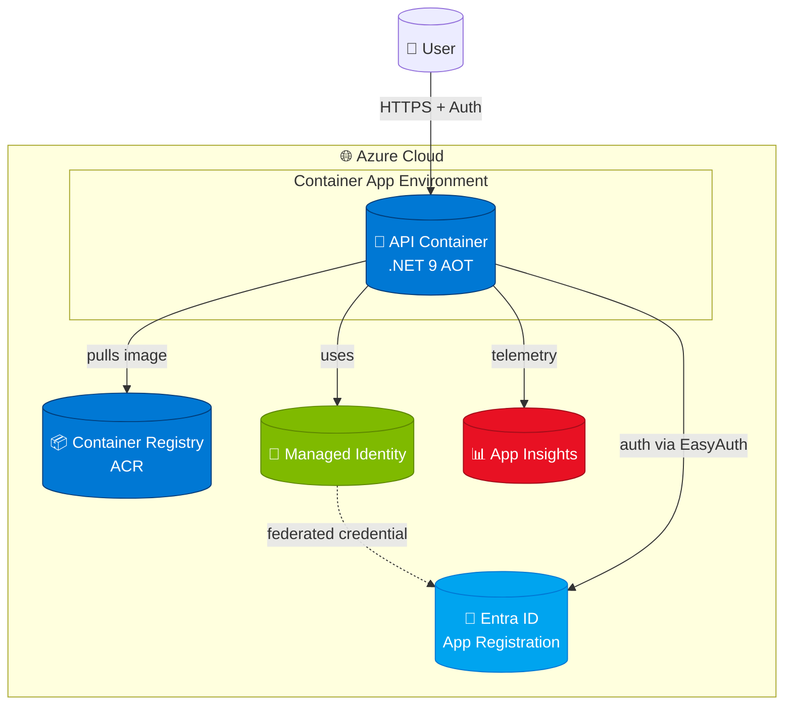
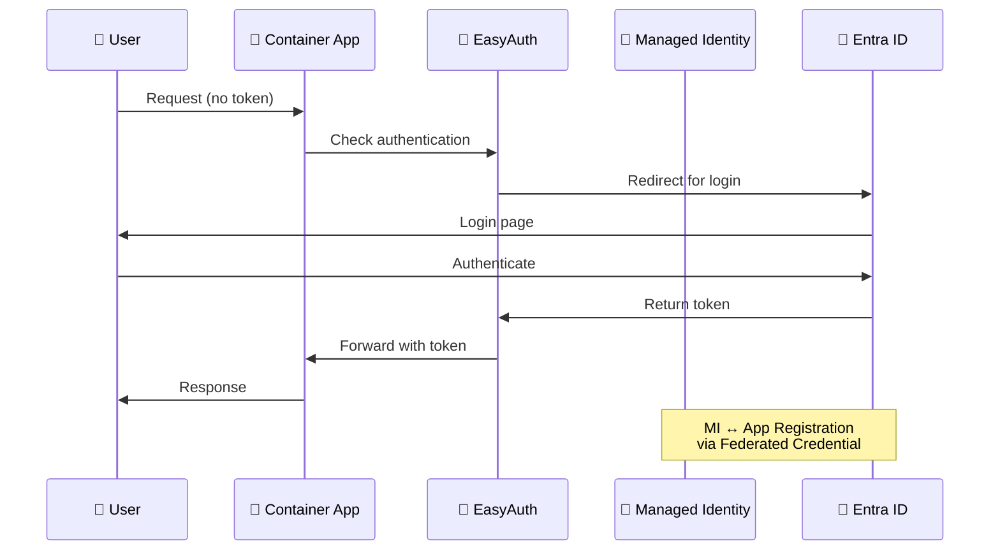
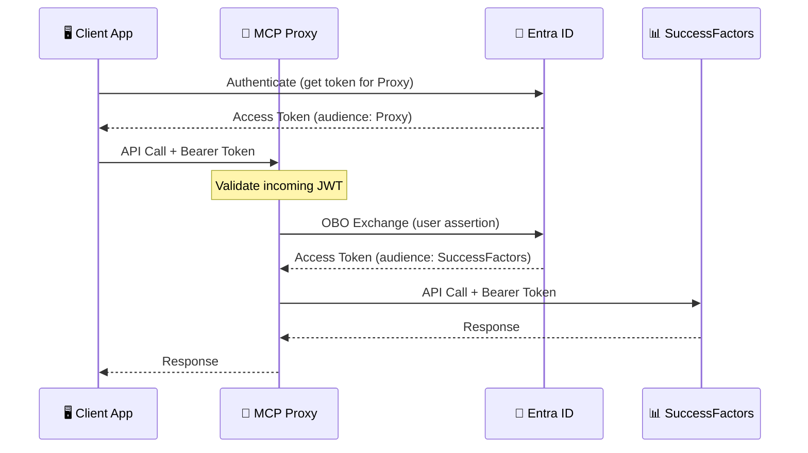

# 🚀 Azure Container Apps MCP Proxy with Federated Identity

> **Model Context Protocol (MCP) wrapper/proxy** deployed on Azure Container Apps with **zero-secrets** authentication using Entra ID federated credentials.

[](https://azure.microsoft.com/en-us/products/container-apps/)
[](https://www.terraform.io/)
[](https://dotnet.microsoft.com/)
[](https://learn.microsoft.com/en-us/dotnet/core/deploying/native-aot/)

## 🎯 What Does This Do?

This project demonstrates a **production-ready pattern** for deploying containerized APIs on Azure with enterprise-grade security:

- 🔐 **No secrets stored anywhere** - uses federated identity credentials
- 🎫 **Entra ID authentication** via EasyAuth on Container Apps
- 🏗️ **Infrastructure as Code** with Terraform and Azure Developer CLI
- ⚡ **Native AOT compilation** for fast startup and minimal memory
- 📊 **Built-in observability** with Application Insights

## 🏛️ Architecture


```mermaid
graph TB
    subgraph "🌐 Azure Cloud"
        subgraph "Container App Environment"
            API[("🔵 API Container<br/>.NET 9 AOT")]
        end
        
        ACR[("📦 Container Registry<br/>ACR")]
        ENTRA[("🎫 Entra ID<br/>App Registration")]
        MI[("🔑 Managed Identity")]
        APPINS[("📊 App Insights")]
        
        API -->|pulls image| ACR
        API -->|uses| MI
        MI -.->|federated credential| ENTRA
        API -->|auth via EasyAuth| ENTRA
        API -->|telemetry| APPINS
    end
    
    USER[("👤 User")] -->|HTTPS + Auth| API
    
    style API fill:#0078D4,stroke:#003d7a,color:#fff
    style ENTRA fill:#00A4EF,stroke:#0078D4,color:#fff
    style MI fill:#7FBA00,stroke:#5e8700,color:#fff
    style ACR fill:#0078D4,stroke:#003d7a,color:#fff
    style APPINS fill:#E81123,stroke:#a30d1a,color:#fff
```

### 🔐 Zero-Secrets Authentication Flow


```mermaid
sequenceDiagram
    participant U as 👤 User
    participant CA as 🔵 Container App
    participant EA as 🎫 EasyAuth
    participant MI as 🔑 Managed Identity
    participant ENTRA as 🏢 Entra ID
    
    U->>CA: Request (no token)
    CA->>EA: Check authentication
    EA->>ENTRA: Redirect for login
    ENTRA->>U: Login page
    U->>ENTRA: Authenticate
    ENTRA->>EA: Return token
    EA->>CA: Forward with token
    CA->>U: Response
    
    Note over MI,ENTRA: MI ↔ App Registration<br/>via Federated Credential
```

## 🚦 Quick Start

### Prerequisites

- ✅ Azure subscription
- ✅ [Azure Developer CLI](https://learn.microsoft.com/en-us/azure/developer/azure-developer-cli/install-azd)
- ✅ [.NET 9 SDK](https://dotnet.microsoft.com/download/dotnet/9.0)
- ✅ [Terraform](https://www.terraform.io/downloads)

### 🎬 Deploy Everything

```bash
# One command to rule them all
azd up
```

This will:
1. 📦 Build container image with AOT compilation
2. 🏗️ Provision Azure infrastructure (Container Apps, ACR, Entra ID app)
3. 🔐 Configure federated identity credentials
4. 🚀 Deploy the container
5. 🔗 Output the API endpoint URL

### 🧪 Local Development

#### Setup Configuration

First, run the setup script to extract Terraform outputs and configure your local environment:

```bash
./scripts/setup-local-config.sh
```

This will update `appsettings.Development.json` with the correct Azure AD and OBO settings.

Alternatively, use environment variables:

```bash
./scripts/setup-local-config.sh --env-vars
source .env.local
```

#### Run the App

```bash
cd src/MCPWrapper/MCPWrapper.Api
dotnet run
```

Access at `http://localhost:5000` (or check console output for port)

> 📝 **Note:** You must run `azd up` at least once before local development to provision the required Entra ID resources.

## 📁 Project Structure

```
📂 aca-mcp-proxy-obo-flow/
├── 📂 .github/
│   └── copilot-instructions.md    # 🤖 AI agent guidance
├── 📂 docs/
│   ├── obo-implementation-plan.md # 📋 OBO flow design
│   └── networking.md              # 🌐 Network architecture
├── 📂 infra/                       # 🏗️ Terraform IaC
│   ├── identity.tf                 # 🔐 Managed Identity + Entra ID
│   ├── containerapps.tf            # 🔵 Container App + Auth config
│   ├── main.tf                     # 🏛️ Core resources (ACR, Log Analytics)
│   ├── rbac.tf                     # 👥 Role assignments
│   └── provider.tf                 # ⚙️ Provider configuration
├── 📂 src/MCPWrapper/
│   ├── MCPWrapper.Api/             # 💻 .NET 9 API
│   │   ├── Auth/                   # 🔐 OBO authentication
│   │   │   ├── OnBehalfOfTokenService.cs
│   │   │   └── SuccessFactorsAuthHandler.cs
│   │   ├── Program.cs              # 🎯 Minimal API with AOT
│   │   ├── Dockerfile              # 🐳 Multi-stage build
│   │   └── MCPWrapper.Api.csproj   # 📦 Project config
│   ├── MCPWrapper.Lib/             # 📚 Shared library
│   │   ├── Config/                 # ⚙️ Configuration models
│   │   ├── Tools/                  # 🔧 MCP tools
│   │   └── Model/                  # 📝 Domain models
│   └── MCPWrapper.Tests/           # 🧪 Integration tests
└── azure.yaml                      # 🎛️ Azure Developer CLI config
```

## 🔑 Key Features

### 🛡️ Security
- **Zero secrets** - federated identity credential pattern
- **EasyAuth** - authentication at platform level (no code changes needed)
- **Managed identities** - for ACR pull and future Azure service access
- **Entra ID integration** - enterprise identity provider
- **On-Behalf-Of (OBO) flow** - secure token exchange for downstream APIs

### ⚡ Performance
- **Native AOT compilation** - faster startup, lower memory
- **Slim builder** - minimal runtime footprint
- **Container-optimized** - efficient image layers
- **Token caching** - in-memory cache with automatic expiration

### 🔧 Developer Experience
- **Azure Developer CLI** - simplified deployment workflow
- **Infrastructure as Code** - reproducible environments
- **Application Insights** - built-in observability

## 🔄 On-Behalf-Of (OBO) Token Flow

The MCP Proxy implements the OAuth 2.0 On-Behalf-Of flow to securely call downstream APIs (like SuccessFactors) using the caller's identity.


```mermaid
sequenceDiagram
    participant Client as 🖥️ Client App
    participant Proxy as 🔵 MCP Proxy
    participant Entra as 🏢 Entra ID
    participant SF as 📊 SuccessFactors

    Client->>Entra: Authenticate (get token for Proxy)
    Entra-->>Client: Access Token (audience: Proxy)
    Client->>Proxy: API Call + Bearer Token
    Note over Proxy: Validate incoming JWT
    Proxy->>Entra: OBO Exchange (user assertion)
    Entra-->>Proxy: Access Token (audience: SuccessFactors)
    Proxy->>SF: API Call + Bearer Token
    SF-->>Proxy: Response
    Proxy-->>Client: Response
```

### OBO Configuration

Configure the OBO flow in `appsettings.json`:

```json
{
  "AzureAd": {
    "TenantId": "<your-tenant-id>",
    "ClientId": "<mcp-proxy-client-id>",
    "ClientSecret": "<client-secret>",
    "Audience": "api://<mcp-proxy-app-id>"
  },
  "SuccessFactors": {
    "SuccessFactorsBaseUrl": "https://your-sf-instance.successfactors.com/odata/v2",
    "DownstreamScope": "api://<successfactors-api-client-id>/.default"
  }
}
```

## 🎯 Why AzAPI Provider?

The `azurerm` Terraform provider doesn't yet support Container Apps authentication blocks (tracked in [issue #22213](https://github.com/hashicorp/terraform-provider-azurerm/issues/22213)). We use the **AzAPI provider** to directly call the ARM API:

```hcl
resource "azapi_resource" "api_auth_config" {
  type = "Microsoft.App/containerApps/authConfigs@2023-05-01"
  # ... EasyAuth configuration
}
```

## 🔄 Common Tasks

### 📊 View Logs
```bash
azd monitor --overview
```

### 🔄 Redeploy Code
```bash
azd deploy
```

### 🗑️ Clean Up Resources
```bash
azd down
```

### 🧹 Local Terraform Operations
```bash
cd infra
terraform plan -var-file=main.tfvars.json
terraform apply -var-file=main.tfvars.json
```

## 🚀 Deployment Scenarios & Configuration

This project supports two distinct deployment models to accommodate different organizational constraints (e.g., "Team M" vs "Team J").

### Scenario A: Full Provisioning ("Team M" / Development)
**Ideal for:** Developers, POCs, and environments where you have permission to create Entra ID App Registrations.

In this mode, Terraform manages **everything**:
- Azure Infrastructure (Container Apps, ACR, etc.)
- **Entra ID Resources** (App Registration, Service Principal, Federated Credentials)
- **OAuth2 Permission Scopes** for OBO flow
- **Downstream API App Registration** (optional mock for testing)
- **Client Secret** for OBO token exchange

**Configuration:**
```hcl
enable_entra_setup    = true
entra_app_name        = "mcp-proxy-dev"
create_app_secret     = true   # Create client secret for OBO

# Optional: Create a mock downstream API for testing OBO
downstream_api_name   = "successfactors-api"

# Optional: Pre-authorize client apps for OBO
known_client_applications = ["<client-app-id>"]

# Optional: Request Microsoft Graph permissions
downstream_api_permissions = [
  {
    resource_app_id            = "00000003-0000-0000-c000-000000000000"  # Microsoft Graph
    delegated_permission_ids   = ["e1fe6dd8-ba31-4d61-89e7-88639da4683d"] # User.Read
    application_permission_ids = []
  }
]
```

### Scenario B: Pre-Provisioned Identity ("Team J" / Production)
**Ideal for:** Production environments or restricted organizations where Identity resources are managed by a separate team.

In this mode, Terraform **only** deploys Azure Infrastructure. It expects the Entra ID resources to exist and takes their IDs as input.

**Configuration:**
```hcl
enable_entra_setup = false

# Pass the details of the pre-created App Registration
existing_entra_config = {
  client_id = "00000000-0000-0000-0000-000000000000"
  tenant_id = "00000000-0000-0000-0000-000000000000"
  object_id = "00000000-0000-0000-0000-000000000000" # Service Principal Object ID
}
```

### 🔑 OBO Configuration Variables

| Variable | Default | Description |
|----------|---------|-------------|
| `enable_entra_setup` | `false` | Master switch to create Entra ID resources |
| `entra_app_name` | `"mcp-proxy-app"` | Display name for the MCP Proxy app registration |
| `create_app_secret` | `true` | Whether to create a client secret for OBO |
| `downstream_api_name` | `""` | Name for optional downstream API registration |
| `known_client_applications` | `[]` | Client app IDs pre-authorized for OBO |
| `grant_graph_permissions` | `false` | Whether to grant Microsoft Graph permissions |
| `graph_delegated_permissions` | `["User.Read", ...]` | Graph permissions to grant |

### 🌐 Networking Options

The project supports flexible networking configurations via Terraform variables:

| Variable | Default | Description |
|----------|---------|-------------|
| `enable_public_network` | `true` | **True**: App is accessible via public internet.<br>**False**: App is private-only (requires Private Endpoint or VNet integration). |
| `create_dummy_vnet` | `true` | **True**: Creates a new VNet/Subnet for testing.<br>**False**: Use existing VNet (must provide `container_apps_subnet_id`). |
| `container_apps_subnet_id` | `""` | ID of the existing subnet for the Container App Environment (required if `create_dummy_vnet = false`). |
| `private_endpoint_subnet_id`| `""` | ID of the subnet to place the Private Endpoint (if `enable_public_network = false`). |

## 🎨 Environment Variables

The container app automatically receives:

| Variable | Description | Source |
|----------|-------------|--------|
| `AZURE_TENANT_ID` | Entra ID tenant | Auto-injected |
| `AZURE_CLIENT_ID` | Managed identity client ID | Auto-injected |
| `APPLICATIONINSIGHTS_CONNECTION_STRING` | Telemetry endpoint | Terraform output |
| `API_ENDPOINT` | Container app URL | Computed |
| `ASPNETCORE_ENVIRONMENT` | Runtime environment | Configuration |

When `enable_entra_setup = true`, additional OBO-related variables are injected:

| Variable | Description |
|----------|-------------|
| `AzureAd__TenantId` | Entra ID tenant ID |
| `AzureAd__ClientId` | MCP Proxy app client ID |
| `AzureAd__ClientSecret` | Client secret for OBO |
| `AzureAd__Audience` | App identifier URI |
| `SuccessFactors__DownstreamScope` | Downstream API scope for OBO |

## 🤝 Contributing

See [`.github/copilot-instructions.md`](.github/copilot-instructions.md) for detailed architectural guidance and conventions.

## 📚 Learn More

- [Azure Container Apps Documentation](https://learn.microsoft.com/en-us/azure/container-apps/)
- [Entra ID Federated Credentials](https://learn.microsoft.com/en-us/entra/workload-id/workload-identity-federation)
- [.NET Native AOT](https://learn.microsoft.com/en-us/dotnet/core/deploying/native-aot/)
- [Azure Developer CLI](https://learn.microsoft.com/en-us/azure/developer/azure-developer-cli/)

## 📄 License

MIT License - see LICENSE file for details

---

**🌟 Built with ❤️ using Azure Container Apps and Terraform**
