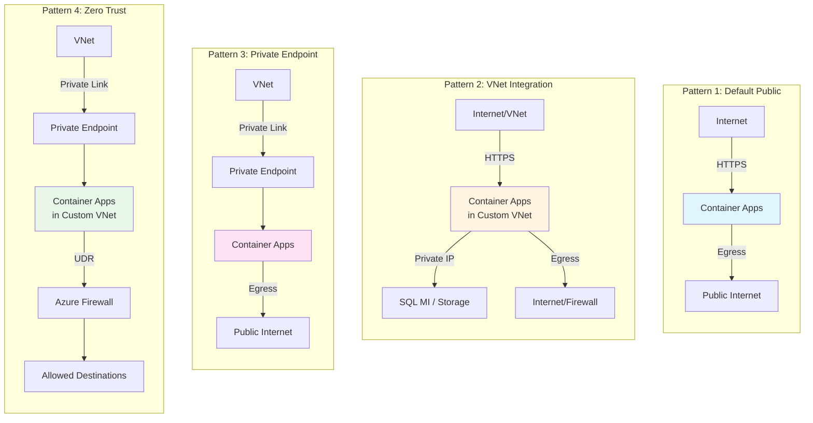
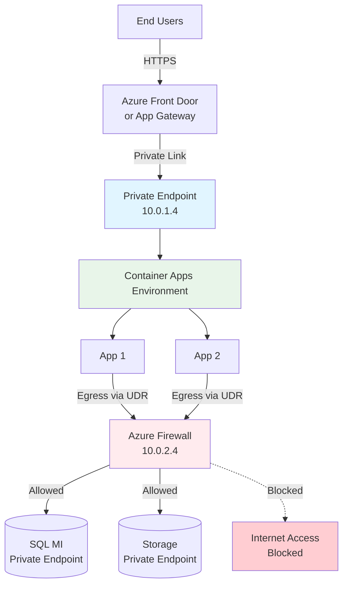
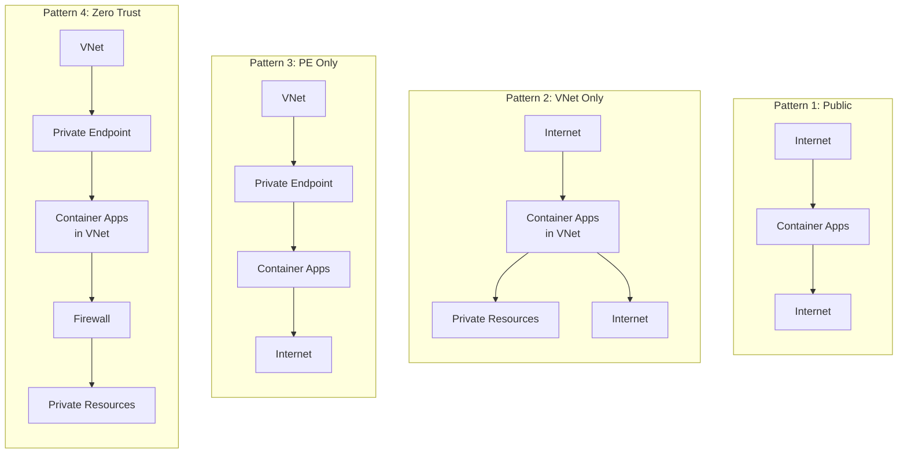

# Azure Container Apps Networking Guide

Complete networking reference for Azure Container Apps with VNet integration and private endpoints.

## Overview

Azure Container Apps supports three networking patterns:

1. **Default (Public)** - Azure-managed network, publicly accessible
2. **VNet Integration** - Deploy into custom VNet for egress control and private resource access
3. **Private Endpoint** - Secure inbound access via Azure Private Link

These patterns can be combined for maximum security (VNet Integration + Private Endpoint = Zero Trust).

## Architecture Patterns



## Quick Decision Matrix

| Pattern | Inbound | Egress | Private Resources | Use Case |
|---------|---------|--------|-------------------|----------|
| **Default** | Public | Internet | ❌ No | Dev/test, public APIs |
| **VNet Only** | Public | VNet + Internet | ✅ Yes | Access SQL MI, private Storage |
| **PE Only** | Private | Internet | ❌ No | Secure inbound, public downstream |
| **VNet + PE** | Private | VNet + Firewall | ✅ Yes | Zero trust, full control |

## Configuration Logic

### Private Endpoint Creation Rules

Private endpoints are created when **ALL** of these are true:
- `enable_public_network = false`
- **AND** either:
  - `create_dummy_vnet = true`, **OR**
  - `private_endpoint_subnet_id` is provided

```hcl
enable_private_endpoint = !var.enable_public_network && 
                         (var.create_dummy_vnet || var.private_endpoint_subnet_id != "")
```

### VNet Integration Rules

VNet integration is enabled when **EITHER**:
- `create_dummy_vnet = true`, **OR**
- `container_apps_subnet_id` is provided

```hcl
enable_vnet_integration = var.create_dummy_vnet || var.container_apps_subnet_id != ""
```

## Configuration Examples

### Pattern 1: Default (Public)

**Simplest setup** - No VNet configuration required.

```json
{
  "enable_public_network": true,
  "create_dummy_vnet": false
}
```

**Architecture:**
```
Internet → Container Apps (Azure-managed) → Internet
```

**Result:**
- ✅ Publicly accessible
- ✅ Fast setup
- ❌ No private resource access
- ❌ No egress control

---

### Pattern 2: VNet Integration Only

**Access private resources** while remaining publicly accessible.

```json
{
  "enable_public_network": true,
  "container_apps_subnet_id": "/subscriptions/.../subnets/cae-subnet",
  "container_apps_vnet_id": "/subscriptions/.../virtualNetworks/my-vnet"
}
```

**Architecture:**
```
Internet → Container Apps (in VNet) → SQL MI, Storage, Key Vault
                                   └→ Internet
```

**Result:**
- ✅ Publicly accessible
- ✅ Can access private resources in VNet
- ✅ Egress through VNet (can add UDR)
- ❌ No inbound security

**Subnet Requirements:**
- Minimum size: `/27` (32 IPs)
- Delegation: `Microsoft.App/environments`
- Reserved IPs: 12 for infrastructure

---

### Pattern 3: Private Endpoint Only

**Secure inbound** access from VNet, public egress.

```json
{
  "enable_public_network": false,
  "private_endpoint_subnet_id": "/subscriptions/.../subnets/pe-subnet",
  "private_endpoint_vnet_id": "/subscriptions/.../virtualNetworks/my-vnet"
}
```

**Architecture:**
```
VNet → Private Endpoint → Container Apps (Azure-managed) → Internet
```

**Result:**
- ✅ Accessible only from VNet via private IP
- ✅ No public exposure
- ❌ Cannot access private resources
- ❌ Egress still uses public internet

**Important:** Private endpoints control **INBOUND only**. Egress still uses default Azure IPs.

---

### Pattern 4: Zero Trust (VNet + Private Endpoint)

**Full control** over inbound and outbound traffic.

```json
{
  "enable_public_network": false,
  "container_apps_subnet_id": "/subscriptions/.../subnets/cae-subnet",
  "container_apps_vnet_id": "/subscriptions/.../virtualNetworks/my-vnet",
  "private_endpoint_subnet_id": "/subscriptions/.../subnets/pe-subnet",
  "private_endpoint_vnet_id": "/subscriptions/.../virtualNetworks/my-vnet"
}
```

**Architecture:**
```
VNet → Private Endpoint → Container Apps (in VNet) → UDR → Firewall → Allowed Destinations
```

**Result:**
- ✅ Private inbound via private endpoint
- ✅ Can access private resources
- ✅ Egress controlled via UDR + Azure Firewall
- ✅ Zero trust compliant

**Requires:**
- Container Apps subnet: `/27` minimum with delegation
- Private endpoint subnet: Any size, no delegation
- User-Defined Route (UDR) to Azure Firewall
- Azure Firewall with allow rules

---

### Pattern 5: Testing with Dummy VNet

**Quick testing** without existing infrastructure.

```json
{
  "enable_public_network": false,
  "create_dummy_vnet": true
}
```

**What it creates:**
- VNet: `10.100.0.0/16`
- Container Apps subnet: `10.100.0.0/27` (with delegation)
- Private endpoint subnet: `10.100.1.0/24`

**Result:**
- ✅ Both VNet integration AND private endpoint
- ✅ Complete test environment
- ⚠️ For testing only, not production

**To test with public access:**
```json
{
  "enable_public_network": true,
  "create_dummy_vnet": true
}
```
This creates VNet integration but **NO private endpoint**.

## Critical Concepts

### Private Endpoint = Inbound Only

⚠️ **Private endpoints control INBOUND traffic only.** They do NOT:
- Route egress through the private endpoint
- Block internet access from containers
- Force traffic through private links

**From Microsoft docs:**
> "The private endpoint is only used for incoming traffic to your app. Outgoing traffic doesn't use the private endpoint."

**For egress control, you MUST:**
1. Use VNet Integration (deploy into custom VNet)
2. Add User-Defined Routes (UDR) pointing to Azure Firewall
3. Configure Azure Firewall with deny-all default policy

**References:**
- [Private Endpoints with Container Apps](https://learn.microsoft.com/azure/container-apps/how-to-use-private-endpoint)
- [User-Defined Routes](https://learn.microsoft.com/azure/container-apps/user-defined-routes)
- [Securing Network Egress](https://techcommunity.microsoft.com/t5/apps-on-azure-blog/securing-network-egress-in-azure-container-apps/ba-p/3915548)

### VNet Integration vs Private Endpoint

These are **independent** and **complementary**:

| Feature | VNet Integration | Private Endpoint |
|---------|------------------|------------------|
| **Purpose** | Egress + private resource access | Secure inbound |
| **Subnet** | Container Apps deployed here | Private endpoint deployed here |
| **Direction** | Outbound | Inbound |
| **Can combine?** | ✅ Yes | ✅ Yes |
| **Same VNet?** | Not required | Not required |

## Subnet Sizing

### Container Apps Subnet (for VNet Integration)

| Subnet | Total IPs | Reserved | Available | Max Replicas (Consumption) |
|--------|-----------|----------|-----------|---------------------------|
| `/27` | 32 | 12 | 20 | ~200 |
| `/26` | 64 | 12 | 52 | ~520 |
| `/25` | 128 | 12 | 116 | ~1,160 |
| `/24` | 256 | 12 | 244 | ~2,440 |

**Calculation:** 1 IP per 10 replicas on Consumption plan.

**Requirements:**
- Minimum: `/27` for Workload Profiles
- Delegation: `Microsoft.App/environments` required
- Exclusive: Cannot share with other services

### Private Endpoint Subnet

- **Minimum:** No strict requirement
- **Recommended:** `/24` (256 IPs)
- **Delegation:** None (should NOT be delegated)
- **Sharing:** Can contain multiple private endpoints

## Variables Reference

| Variable | Type | Default | Description |
|----------|------|---------|-------------|
| `enable_public_network` | bool | `true` | Public access enabled. Set to `false` to create private endpoint. |
| `create_dummy_vnet` | bool | `false` | Auto-create test VNet with both subnets. |
| `container_apps_subnet_id` | string | `""` | Custom subnet for VNet integration. Format: `/subscriptions/{sub}/resourceGroups/{rg}/providers/Microsoft.Network/virtualNetworks/{vnet}/subnets/{subnet}` |
| `container_apps_vnet_id` | string | `""` | VNet ID containing Container Apps subnet. |
| `private_endpoint_subnet_id` | string | `""` | Custom subnet for private endpoint. |
| `private_endpoint_vnet_id` | string | `""` | VNet ID containing private endpoint subnet. |

## Deployment Examples

### Deploy with VNet Integration

```bash
# 1. Create or identify subnet (minimum /27)
az network vnet subnet create \
  --resource-group my-rg \
  --vnet-name my-vnet \
  --name cae-subnet \
  --address-prefixes 10.0.1.0/27 \
  --delegations Microsoft.App/environments

# 2. Configure variables
cat > infra/main.tfvars.json << EOF
{
  "location": "eastus",
  "environment_name": "my-env",
  "enable_public_network": true,
  "container_apps_subnet_id": "/subscriptions/.../subnets/cae-subnet",
  "container_apps_vnet_id": "/subscriptions/.../virtualNetworks/my-vnet"
}
EOF

# 3. Deploy
azd up
```

### Deploy with Private Endpoint

```bash
# 1. Configure variables
cat > infra/main.tfvars.json << EOF
{
  "location": "eastus",
  "environment_name": "my-env",
  "enable_public_network": false,
  "private_endpoint_subnet_id": "/subscriptions/.../subnets/pe-subnet",
  "private_endpoint_vnet_id": "/subscriptions/.../virtualNetworks/my-vnet"
}
EOF

# 2. Deploy
azd up

# 3. Test from VNet
# DNS resolves to private IP
nslookup my-app.xxx.eastus.azurecontainerapps.io
```

### Deploy Zero Trust

```bash
# 1. Configure both VNet integration and private endpoint
cat > infra/main.tfvars.json << EOF
{
  "location": "eastus",
  "environment_name": "my-env",
  "enable_public_network": false,
  "container_apps_subnet_id": "/subscriptions/.../subnets/cae-subnet",
  "container_apps_vnet_id": "/subscriptions/.../virtualNetworks/my-vnet",
  "private_endpoint_subnet_id": "/subscriptions/.../subnets/pe-subnet",
  "private_endpoint_vnet_id": "/subscriptions/.../virtualNetworks/my-vnet"
}
EOF

# 2. Deploy
azd up

# 3. Add UDR to Container Apps subnet
az network route-table create \
  --resource-group my-rg \
  --name aca-route-table

az network route-table route create \
  --resource-group my-rg \
  --route-table-name aca-route-table \
  --name default-route \
  --address-prefix 0.0.0.0/0 \
  --next-hop-type VirtualAppliance \
  --next-hop-ip-address <FIREWALL_PRIVATE_IP>

az network vnet subnet update \
  --resource-group my-rg \
  --vnet-name my-vnet \
  --name cae-subnet \
  --route-table aca-route-table
```

## Outputs

After deployment, check networking status:

```bash
cd infra
terraform output

# Key outputs:
VNET_INTEGRATION_ENABLED      # true/false
PRIVATE_ENDPOINT_ENABLED      # true/false
PRIVATE_ENDPOINT_IP           # Private IP or null
CONTAINER_APPS_SUBNET_ID      # Subnet ID or null
PUBLIC_NETWORK_ENABLED        # true/false
DUMMY_VNET_CREATED            # true/false
```

## Common Issues

### Error: "Subnet is not delegated"

**Solution:**
```bash
az network vnet subnet update \
  --resource-group $RG \
  --vnet-name $VNET \
  --name $SUBNET \
  --delegations Microsoft.App/environments
```

### Error: "Subnet too small"

Container Apps requires minimum `/27` for Workload Profiles. Resize or use different subnet.

### Private endpoint created but not accessible

**Check:**
1. Is `enable_public_network = false`?
2. Is Private DNS zone linked to VNet?
3. Test DNS resolution from within VNet:
   ```bash
   nslookup my-app.<env>.<region>.azurecontainerapps.io
   # Should return private IP (10.x.x.x)
   ```

### Can't access private resources from Container Apps

**Check:**
1. Is VNet integration enabled? (Not just private endpoint)
2. Are resources in same VNet or peered VNet?
3. Are NSG rules allowing traffic?
4. Are private endpoints configured on downstream resources (SQL, Storage)?

### Expecting PE but none created

If `enable_public_network = true`, private endpoint will NOT be created regardless of other settings. Set `enable_public_network = false` to enable private endpoint creation.

## Cost Considerations

### Private Endpoint Costs

When private endpoint is enabled:
- **Azure Private Link:** ~$0.01/hour per endpoint + data processing
- **Container Apps Dedicated Plan Management:** Additional fixed monthly charge

**Estimate:** ~$7.50-$10/month for private endpoint infrastructure.

### VNet Integration Costs

- **No extra charge** for VNet integration itself
- **Optional:** Azure Firewall (~$1.25/hour) if egress control needed
- **Optional:** NAT Gateway (~$0.045/hour) for static egress IPs

### Cost Optimization

✅ Use VNet integration instead of private endpoint if you control the entire VNet  
✅ Use private endpoint only when connecting from hub VNet or external VNets  
✅ Use `create_dummy_vnet = true` only for testing (not production)

## Best Practices

### Production
- ✅ Use Workload Profiles (v2) environment type
- ✅ Deploy into custom VNet with `/27` minimum subnet
- ✅ Combine VNet integration + private endpoint for zero trust
- ✅ Add UDR + Azure Firewall for egress control
- ✅ Use private DNS zones for name resolution
- ✅ Disable public network access for sensitive workloads
- ✅ Separate subnets for Container Apps vs private endpoints

### Development
- ✅ Use default public access for fast iteration
- ✅ Use `create_dummy_vnet = true` for testing networking
- ✅ Test with dummy VNet before production deployment
- ✅ Consider public network for easier debugging

### Security
- ✅ Always use VNet integration when accessing private resources
- ✅ Disable public network when using private endpoints
- ✅ Implement NSGs on subnets for defense in depth
- ✅ Use Azure Firewall application rules for outbound filtering
- ✅ Enable diagnostic logs for security monitoring

## Architecture Diagrams

### Complete Zero Trust Architecture



### Simple Patterns



## References

### Microsoft Documentation
- [Container Apps Networking Overview](https://learn.microsoft.com/azure/container-apps/networking)
- [VNet Integration](https://learn.microsoft.com/azure/container-apps/custom-virtual-networks)
- [Private Endpoints](https://learn.microsoft.com/azure/container-apps/how-to-use-private-endpoint)
- [User-Defined Routes](https://learn.microsoft.com/azure/container-apps/user-defined-routes)
- [Workload Profiles](https://learn.microsoft.com/azure/container-apps/workload-profiles-overview)

### Technical Articles
- [Securing Network Egress (TechCommunity)](https://techcommunity.microsoft.com/t5/apps-on-azure-blog/securing-network-egress-in-azure-container-apps/ba-p/3915548)
- [Private Endpoints with DNS](https://learn.microsoft.com/azure/container-apps/private-endpoints-with-dns)

### Pricing
- [Container Apps Pricing](https://azure.microsoft.com/pricing/details/container-apps/)
- [Private Link Pricing](https://azure.microsoft.com/pricing/details/private-link/)
