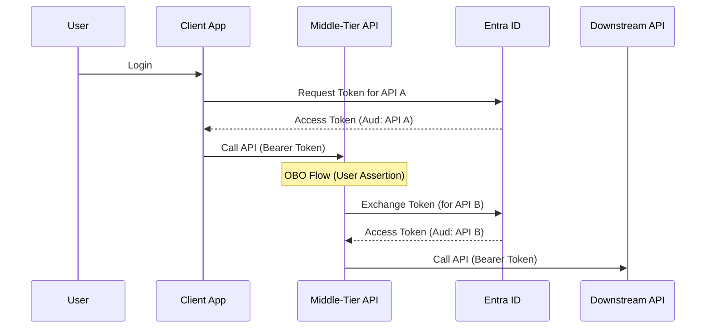
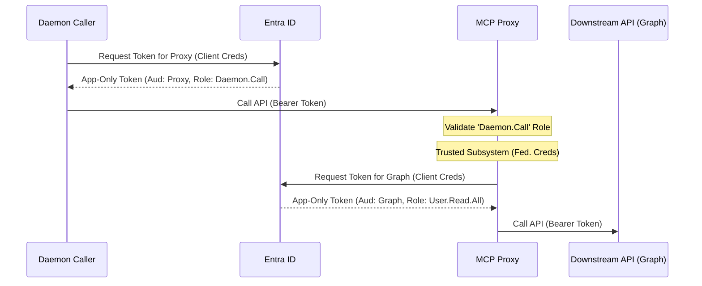

# Service-to-Service "OBO" Implementation Plan (UI-Less / Daemon)

## Overview

This document outlines the plan to implement a secure Service-to-Service authentication flow for the MCP Proxy.
Since the system is **UI-less** and accessed by other applications (Daemons/Services) without user interaction, the standard OAuth 2.0 On-Behalf-Of (OBO) flow (which requires a user context) is **not applicable**.

Instead, we will implement the **Client Credentials Flow** chain:
1.  **Caller -> MCP Proxy**: Caller authenticates using its own Client Credentials (App-Only).
2.  **MCP Proxy -> Downstream (e.g., Graph)**: MCP Proxy authenticates using its own Client Credentials (App-Only), utilizing **Federated Identity Credentials** to avoid secrets.

This approach requires **Application Permissions** (App Roles) and **Admin Consent**, which we will automate via Terraform.

## Why Standard OBO is Not Applicable

The OAuth 2.0 On-Behalf-Of (OBO) flow is designed to propagate a **user's identity** through a chain of services. It requires a user assertion (e.g., a token issued to a user).
**Limitation**: Microsoft Entra ID **does not support** the OBO flow for **App-Only tokens** (tokens issued via Client Credentials flow). If a service tries to perform OBO with an app-only token, Entra ID will reject the request.
*   **Reference**: [Microsoft identity platform and OAuth 2.0 On-Behalf-Of flow - Client limitations](https://learn.microsoft.com/en-us/entra/identity-platform/v2-oauth2-on-behalf-of-flow#client-limitations) ("If a service principal requested an app-only token and sent it to an API, that API would then exchange a token that doesn't represent the original service principal. This is because the OBO flow only works for user principals.")

### Standard OBO Flow (User Context Only)

## The "Trusted Subsystem" Pattern (Impersonation Alternative)

Since we cannot use OBO to "impersonate" the caller at the protocol level, we use the **Trusted Subsystem** pattern:
1.  **Caller Authentication**: The Caller authenticates to the MCP Proxy. The MCP Proxy validates the caller's identity (via the incoming token's `appid` and `roles`).
2.  **Proxy Authority**: The MCP Proxy has its own high-level permissions (Application Permissions) to call the Downstream API (e.g., `User.Read.All`).
3.  **Logic**: The MCP Proxy is "trusted" to make calls on behalf of the caller. It is the MCP Proxy's responsibility to ensure the caller is authorized to request that specific action.
    *   *Example*: If Caller A asks for "User B's data", the MCP Proxy checks if Caller A is allowed to see User B's data, then uses its own `User.Read.All` permission to fetch it from Graph.

### Trusted Subsystem Flow (App Context)

## Part 1: Terraform Configuration (Entra ID)

The Terraform setup will be responsible for configuring the necessary Entra ID resources. This setup will be **optional**, controlled by a feature flag variable.

### 1. New Terraform Variables

We will introduce new variables to `infra/variables.tf` to control the setup:

- `enable_entra_setup` (bool, default: `false`): Master switch to create Entra ID resources.
- `entra_app_name` (string): Name for the App Registration.
- `downstream_api_permissions` (list of objects): List of **Application Permissions** (App Roles) required for the downstream API (e.g., `User.Read.All`, `Mail.Read` on Graph).
- `existing_entra_config` (object, optional): If `enable_entra_setup` is false, this object provides the necessary Client ID, Tenant ID, and other config values.

### 2. Resources to Create

If `enable_entra_setup` is `true`, the following resources will be created in a new `infra/entra_obo.tf` file:

#### A. App Registration (`azuread_application`)

- **Purpose**: Represents the MCP API in Entra ID.
- **Configuration**:
  - `display_name`: `${var.entra_app_name}`
  - `sign_in_audience`: `AzureADMyOrg`.
  - **App Roles (Exposed Permissions)**:
    - Define an App Role named `Daemon.Call` (or similar) to allow calling services to request a token for this API.
    - `allowed_member_types`: `["Application"]`
    - `description`: "Allows daemon apps to call the MCP Proxy."
  - **Required Resource Access**:
    - Configure **Application Permissions** (Type: `Role`) for downstream APIs based on `var.downstream_api_permissions`.

#### B. Service Principal (`azuread_service_principal`)

- **Purpose**: The instantiation of the App Registration in the tenant.
- **Configuration**:
  - `client_id`: Reference the created App Registration.
  - `use_existing`: `true` (if importing) or create new.

#### C. Federated Identity Credential (`azuread_application_federated_identity_credential`)

- **Purpose**: Enables the Azure Container App's Managed Identity to authenticate as this App Registration without secrets (Client Assertion).
- **Configuration**:
  - `application_object_id`: Reference the App Registration.
  - `display_name`: "aca-federated-credential"
  - `audiences`: `["api://AzureADTokenExchange"]`
  - `issuer`: The OIDC issuer URL of the User Assigned Managed Identity.
  - `subject`: The `principal_id` of the User Assigned Managed Identity.

#### D. Admin Consent Automation (`azuread_app_role_assignment`)

- **Purpose**: Automates the "Admin Consent" process by assigning the required Application Permissions (App Roles) to the MCP Proxy's Service Principal.
- **Mechanism**:
  - Iterate over `var.downstream_api_permissions`.
  - Create an `azuread_app_role_assignment` resource for each permission.
  - **Principal**: The MCP Proxy's Service Principal.
  - **Resource**: The Downstream API's Service Principal (e.g., Microsoft Graph).
  - **App Role ID**: The ID of the permission (e.g., `User.Read.All`).

### 3. Integration with Existing Infrastructure

- **Managed Identity**: The existing `infra/identity.tf` creates a User Assigned Identity. We need to ensure its OIDC issuer URL is available.
- **Container App Config**:
  - Pass the `ClientId` of the App Registration to the Container App as an environment variable (`ENTRA_CLIENT_ID`).
  - Pass the `TenantId`.
  - Pass the `DownstreamApiScopes` (which will be `https://graph.microsoft.com/.default` for App-Only flows).

### 4. Outputs

The Terraform module should output:

- `entra_app_client_id`: The Client ID of the created (or existing) App Registration.
- `entra_app_tenant_id`: The Tenant ID.
- `entra_app_role_id`: The ID of the exposed `Daemon.Call` App Role (for callers to assign).

## Part 2: Code Implementation (Future)

*(This section is a placeholder for the next phase)*

- **Incoming Token Validation**: Validate the `roles` claim (App Permissions) instead of `scp` (Delegated Scopes).
- **Downstream Call**:
  - Use `ClientCredentialsCredential` (from `Azure.Identity`) configured with the Managed Identity Client Assertion.
  - Request token for `https://graph.microsoft.com/.default`.
  - This token will contain the Application Permissions granted via Admin Consent (Terraform).
